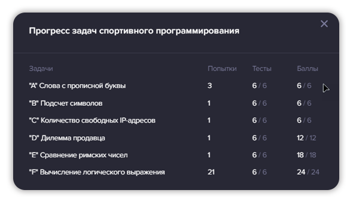

# Ozon-Route-256-Contest-First-Stream
Собственно, поучаствовал тут в контесте от Route 256 и получил классный экспириенс. Жаль, что пролетел из-за одного задания по sql, не успел сделать. Попытаю удачу, позже, во 2-м потоке.🙂🙃

# Мой результат:

# Список заданий:
1. [Слова с прописной буквы](Ozon.CapitalizedWords/Program.cs) (сложность 1/5);
2. [Подсчет символов](Ozon.CountingCharacters/Program.cs) (сложность 1/5);
3. [Количество свободных IP-адресов](Ozon.CountingIPByRange/Program.cs) (сложность 1/5);
4. [Дилемма продавца](Ozon.SalesmanDilemma/Program.cs) (сложность 2/5);
5. [Сравнение римских чисел](Ozon.ComparisonRomanNumbers/Program.cs) (сложность 3/5);
6. [Вычисление логического выражения](Ozon.EvaluatingBooleanExpression/Program.cs) (сложность 4/5);
7. [SQL: Подсчёт статистики](sql-task.png) (сложность 3/5).
#
_***PS:*** Задачи рассчитаны на джуна._
